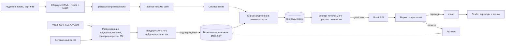

# Email-рассылка — архитектура

Решение владельца 13.09.2026: отдельная страница «Рассылка» в левом меню,
отправка через ящик Google, внедрение по фазам. Документ — рабочая
спецификация: каждая фаза сверяется с ним, а расхождения правятся здесь же,
а не «в голове».

Репозиторий публичный: в этом документе, в коде и в тестах — ни живых адресов,
ни ключей. Образцы для тестов — выдуманные адреса на `example.com`.

---

## 1. Что строим и чего не строим

**Строим** внутренний рассыльщик школ: базы адресов по проектам, загрузка с
распознаванием, просмотр и правка баз, письмо из блоков, отправка через Gmail с
дозированием под лимиты Google, отписка, отчёт «отправлено → переходы → заявки».

**Не строим** (сейчас):

- сервис на тысячи писем в день — это потолок Gmail, а не наш; замена транспорта
  предусмотрена (§8.6);
- счётчик открытий — Gmail и Apple сами подгружают картинки, цифра была бы
  неправдой;
- произвольный HTML в письме — только блоки: безопасность и предсказуемая вёрстка;
- автоматический разбор возвратов — ему нужно право читать почту (фаза 6).

## 2. Опорные решения

| Решение | Почему |
|---|---|
| **Gmail API с одним правом `gmail.send`** | Панель может только отправлять и не может читать ящик. Пароль приложения дал бы ей весь ящик, и Google отключает его политикой. |
| **Лучше не дослать, чем прислать дважды** | Письмо нельзя удалить. Отправка, прерванная без ответа Google, помечается «неизвестно» и сама не повторяется — тот же принцип, что `needs_check` у постов. |
| **Картинка живёт, пока рассылка не закончится, и уходит внутри письма** (решение владельца) | Картинка вкладывается в письмо (`Content-ID`), а не ссылкой: после снятия файла с сервера письмо у получателя и в «Отправленных» остаётся целым. «Закончится» — это последний адресат, а не время старта: дозированная рассылка идёт несколько дней. |
| **Базы и отписка принадлежат проекту (школе)** | Контакт уникален в пределах школы. Отписка действует на все базы этой школы — иначе человек отписался и получил письмо из соседней базы. |
| **Стоп-лист по хешу адреса, отдельно от контактов** | Отписанные, недоставляемые и стёртые по просьбе живут в одной таблице. Повторная загрузка той же базы их не воскрешает, даже если сам контакт стёрт. |
| **Лимиты и пороги — в одном месте**, `src/mail/specs.js` | Правило продукта: разъехавшиеся копии лимитов — это «не ушло, а почему — непонятно». |
| **Один сборщик письма, на сервере** | Предпросмотр, пробное и боевое письмо собирает один модуль: что видели в предпросмотре, то и уходит. |
| **Без новых зависимостей** | MIME, CSV, XLSX, vCard — свои модули на встроенных `node:zlib`, `node:dns`, `node:crypto`, как и вся панель. |
| **Время в новых таблицах — ISO UTC с `Z`** | Урок миграции 017: дата без зоны однажды сдвинула посты на три часа. Окно отправки считается по `Europe/Kyiv`. |
| **Интерфейс по-русски, письма и страница отписки — по-украински** | Панель — для команды, письма — для учеников, как и сайты сети. |

## 3. Схема



## 4. Данные

Одна миграция на фазу. **Номер — следующий свободный в момент фазы**:
параллельные сессии тоже добавляют миграции, а порядок задаёт массив в `db.js`,
а не имя.

### Фаза 1 — базы

```sql
-- Базы. Принадлежат школе. Основание согласия обязательно — оно же
-- печатается в подвале письма: «ви отримали цей лист, бо…».
CREATE TABLE mail_lists (
  id            INTEGER PRIMARY KEY AUTOINCREMENT,
  project_id    INTEGER NOT NULL REFERENCES projects(id) ON DELETE CASCADE,
  name          TEXT NOT NULL,
  description   TEXT NOT NULL DEFAULT '',
  consent_basis TEXT NOT NULL,              -- form | lead | client | event | other
  consent_note  TEXT NOT NULL DEFAULT '',
  columns       TEXT NOT NULL DEFAULT '[]', -- свои колонки базы в порядке файла
  created_by    INTEGER REFERENCES staff(id),
  created_at    TEXT NOT NULL,
  archived_at   TEXT,                       -- не удаляем: «ничего не удалять из боевой базы»
  UNIQUE (project_id, name)
);

-- Человек в пределах школы: один адрес — одна строка, в скольких бы базах он ни был.
CREATE TABLE mail_contacts (
  id          INTEGER PRIMARY KEY AUTOINCREMENT,
  project_id  INTEGER NOT NULL REFERENCES projects(id) ON DELETE CASCADE,
  email       TEXT NOT NULL,                -- нормализованный, нижний регистр
  name        TEXT NOT NULL DEFAULT '',
  status      TEXT NOT NULL DEFAULT 'active', -- active | unsubscribed | bounced | invalid — для показа
  status_note TEXT,
  status_at   TEXT,
  created_at  TEXT NOT NULL,
  updated_at  TEXT NOT NULL,
  UNIQUE (project_id, email)
);

-- Загрузки: история и предпросмотр.
CREATE TABLE mail_imports (
  id          INTEGER PRIMARY KEY AUTOINCREMENT,
  project_id  INTEGER NOT NULL REFERENCES projects(id) ON DELETE CASCADE,
  list_id     INTEGER REFERENCES mail_lists(id),
  source_name TEXT NOT NULL,                 -- имя файла или «вставленный текст»
  format      TEXT NOT NULL,                 -- csv | tsv | xlsx | vcf | text
  encoding    TEXT,
  delimiter   TEXT,
  sheet       TEXT,
  mapping     TEXT NOT NULL DEFAULT '{}',    -- какая колонка чем считается
  stats       TEXT NOT NULL DEFAULT '{}',
  progress    TEXT NOT NULL DEFAULT '{}',
  status      TEXT NOT NULL,                 -- parsing | checking | preview | done | discarded | failed
  created_by  INTEGER REFERENCES staff(id),
  created_at  TEXT NOT NULL,
  finished_at TEXT
);

-- Членство в базе. Свои колонки файла живут здесь, а не в контакте:
-- «курс» из одной базы не затирает «курс» из другой.
CREATE TABLE mail_list_members (
  list_id     INTEGER NOT NULL REFERENCES mail_lists(id) ON DELETE CASCADE,
  contact_id  INTEGER NOT NULL REFERENCES mail_contacts(id) ON DELETE CASCADE,
  attrs       TEXT NOT NULL DEFAULT '{}',
  import_id   INTEGER REFERENCES mail_imports(id),
  added_by    INTEGER REFERENCES staff(id),
  added_at    TEXT NOT NULL,
  removed_at  TEXT,
  PRIMARY KEY (list_id, contact_id)
);

-- Стоп-лист — единственный источник правды для «не слать». Проверяется
-- при загрузке, при снимке аудитории и ещё раз перед каждым письмом.
CREATE TABLE mail_suppressions (
  project_id  INTEGER NOT NULL REFERENCES projects(id) ON DELETE CASCADE,
  email_hash  TEXT NOT NULL,                 -- sha256 нормализованного адреса: переживает стирание
  reason      TEXT NOT NULL,                 -- unsubscribed | bounced | invalid | erased | manual
  campaign_id INTEGER,
  note        TEXT,
  created_at  TEXT NOT NULL,
  PRIMARY KEY (project_id, email_hash)
);

-- Разобранные строки до подтверждения. Это черновик, а не данные школы:
-- стираются при подтверждении, отказе или через сутки.
CREATE TABLE mail_import_rows (
  import_id  INTEGER NOT NULL REFERENCES mail_imports(id) ON DELETE CASCADE,
  row_no     INTEGER NOT NULL,
  raw        TEXT NOT NULL,                  -- ячейки строки, JSON
  email      TEXT,
  name       TEXT,
  verdict    TEXT NOT NULL,                  -- ok | warning | fixable | invalid | duplicate | suppressed
  issues     TEXT NOT NULL DEFAULT '[]',
  suggestion TEXT,                           -- предложенное исправление опечатки
  decision   TEXT,                           -- add | fix | skip — выбор человека
  PRIMARY KEY (import_id, row_no)
);

CREATE INDEX idx_mail_members_contact ON mail_list_members(contact_id);
CREATE INDEX idx_mail_contacts_status ON mail_contacts(project_id, status);
```

### Фаза 2 — ящик и отписка

```sql
-- Ящики-отправители. Общие для панели: лимит Google считается на ящик, а не на школу.
CREATE TABLE mail_senders (
  id                INTEGER PRIMARY KEY AUTOINCREMENT,
  provider          TEXT NOT NULL DEFAULT 'gmail',
  email             TEXT NOT NULL UNIQUE,
  display_name      TEXT NOT NULL DEFAULT '',
  kind              TEXT NOT NULL,           -- gmail | workspace → потолок Google 500 | 2000
  refresh_token_enc TEXT NOT NULL,           -- secrets.encrypt; access-токен живёт только в памяти
  scopes            TEXT NOT NULL DEFAULT '',
  token_saved_at    TEXT NOT NULL,
  token_expires_at  TEXT,                    -- только если Google сам назвал срок
  daily_cap         INTEGER,                 -- свой потолок; NULL — 80 % от потолка Google
  warmup_from       TEXT,                    -- NULL — прогрев выключен
  window_from       TEXT NOT NULL DEFAULT '08:00',
  window_to         TEXT NOT NULL DEFAULT '21:00',
  paused_until      TEXT,                    -- Google сказал «лимит» — ждём
  state             TEXT NOT NULL DEFAULT 'unknown', -- ok | expiring | dead | unknown
  checked_at        TEXT,
  last_error        TEXT,
  warned_stage      TEXT,
  created_at        TEXT NOT NULL,
  disconnected_at   TEXT
);

-- Пробные письма: доказательство «эту версию видели глазами» и вклад в
-- суточный счётчик ящика. campaign_id пуст у проверки ящика.
CREATE TABLE mail_test_sends (
  id           INTEGER PRIMARY KEY AUTOINCREMENT,
  sender_id    INTEGER NOT NULL REFERENCES mail_senders(id),
  campaign_id  INTEGER,
  content_hash TEXT,
  to_email     TEXT NOT NULL,
  gmail_id     TEXT,
  sent_by      INTEGER REFERENCES staff(id),
  sent_at      TEXT NOT NULL
);

CREATE TABLE mail_events (
  id          INTEGER PRIMARY KEY AUTOINCREMENT,
  project_id  INTEGER NOT NULL,
  campaign_id INTEGER,
  contact_id  INTEGER,
  type        TEXT NOT NULL,                 -- unsubscribed | resubscribed | bounced | marked_invalid
  source      TEXT NOT NULL,                 -- one_click | page | manual | import
  note        TEXT,
  at          TEXT NOT NULL
);

CREATE INDEX idx_mail_tests_sender ON mail_test_sends(sender_id, sent_at);
CREATE INDEX idx_mail_events_campaign ON mail_events(campaign_id, type);
```

Настройки приложения Google — в существующей `settings`:
`google_client_id`, `google_client_secret` (шифротекстом).

### Фаза 3 — письмо

```sql
CREATE TABLE mail_campaigns (
  id            INTEGER PRIMARY KEY AUTOINCREMENT,
  project_id    INTEGER NOT NULL REFERENCES projects(id) ON DELETE CASCADE,
  sender_id     INTEGER REFERENCES mail_senders(id),
  title         TEXT NOT NULL DEFAULT '',     -- внутреннее название
  subject       TEXT NOT NULL DEFAULT '',
  preheader     TEXT NOT NULL DEFAULT '',
  from_name     TEXT NOT NULL DEFAULT '',
  reply_to      TEXT,
  blocks        TEXT NOT NULL DEFAULT '[]',
  content_hash  TEXT,                         -- считается при каждом сохранении
  status        TEXT NOT NULL DEFAULT 'draft',
  review_note   TEXT,
  approved_by   INTEGER REFERENCES staff(id),
  approved_at   TEXT,
  approved_hash TEXT,                         -- воркер не шлёт, если содержимое изменилось после утверждения
  scheduled_at  TEXT,
  started_at    TEXT,
  finished_at   TEXT,
  pause_reason  TEXT,
  copied_from   INTEGER REFERENCES mail_campaigns(id),
  created_by    INTEGER REFERENCES staff(id),
  created_at    TEXT NOT NULL,
  updated_at    TEXT NOT NULL,
  deleted_at    TEXT
);

CREATE TABLE mail_campaign_lists (
  campaign_id INTEGER NOT NULL REFERENCES mail_campaigns(id) ON DELETE CASCADE,
  list_id     INTEGER NOT NULL REFERENCES mail_lists(id),
  mode        TEXT NOT NULL DEFAULT 'include', -- include | exclude
  PRIMARY KEY (campaign_id, list_id)
);

-- Картинки писем. Каталог data/mail-media, без публичной раздачи.
CREATE TABLE mail_media (
  id            INTEGER PRIMARY KEY AUTOINCREMENT,
  campaign_id   INTEGER NOT NULL REFERENCES mail_campaigns(id) ON DELETE CASCADE,
  stored_name   TEXT NOT NULL,
  thumb_name    TEXT,
  original_name TEXT NOT NULL,
  mime          TEXT NOT NULL,
  bytes         INTEGER NOT NULL,
  width         INTEGER,
  height        INTEGER,
  created_at    TEXT NOT NULL,
  purged_at     TEXT
);

-- Короткие ссылки из писем — в ту же таблицу, что у постов.
ALTER TABLE links ADD COLUMN campaign_id INTEGER REFERENCES mail_campaigns(id);

CREATE INDEX idx_mail_campaigns_due ON mail_campaigns(status, scheduled_at);
CREATE INDEX idx_mail_media_stored ON mail_media(stored_name);
```

### Фаза 4 — отправка

```sql
-- Одно письмо одному человеку. UNIQUE — страховка самой базы от дубля внутри рассылки.
CREATE TABLE mail_sends (
  id            INTEGER PRIMARY KEY AUTOINCREMENT,
  campaign_id   INTEGER NOT NULL REFERENCES mail_campaigns(id) ON DELETE CASCADE,
  sender_id     INTEGER NOT NULL REFERENCES mail_senders(id),
  contact_id    INTEGER REFERENCES mail_contacts(id) ON DELETE SET NULL,
  email         TEXT NOT NULL,                -- снимок: правка контакта не меняет идущую рассылку
  name          TEXT NOT NULL DEFAULT '',
  via_list_id   INTEGER,                      -- через какую базу попал: её колонки — для подстановок
  status        TEXT NOT NULL DEFAULT 'queued', -- queued | sending | sent | failed | skipped | unknown | cancelled
  attempts      INTEGER NOT NULL DEFAULT 0,
  sending_since TEXT,
  sent_at       TEXT,
  gmail_id      TEXT,
  error         TEXT,
  UNIQUE (campaign_id, email)
);

CREATE INDEX idx_mail_sends_queue ON mail_sends(campaign_id, status, id);
CREATE INDEX idx_mail_sends_sender_day ON mail_sends(sender_id, sent_at);
CREATE INDEX idx_mail_sends_contact ON mail_sends(contact_id);
```

## 5. Модули

```
src/mail/
  specs.js          лимиты Google, пороги проверок, прогрев, окно — единственное место
  store.js          базы, контакты, членство, стоп-лист: чтение, поиск, правка
  import/
    decode.js       байты → текст: BOM, UTF-8, UTF-16, windows-1251
    csv.js          разделитель, кавычки, переносы внутри ячеек
    xlsx.js         свой разбор: zip через node:zlib, sharedStrings + лист
    vcard.js        .vcf из Google Контактов и телефона
    text.js         адреса из произвольного текста, вид «Имя <адрес>»
    columns.js      где заголовок, где адрес, где имя
    address.js      нормализация и проверка адреса: синтаксис, двойники, опечатки, роли
    mx.js           есть ли у домена почтовый сервер (node:dns, кэш, таймаут)
    pipeline.js     файл → строки предпросмотра → подтверждение одной транзакцией
  sender/
    google-oauth.js ссылка согласия, обмен кода, отзыв
    gmail.js        транспорт: send(raw) → id; ответы Google → понятные виды ошибок
    health.js       сторож ящиков — вызывается из обхода токенов
  compose/
    blocks.js       модель блоков и проверка значений
    render.js       блоки → HTML 600 px + текстовая версия; подстановки; подвал
    mime.js         письмо RFC 5322: заголовки, кодирование, вложенные картинки
    checks.js       блокеры и предупреждения — как validate.js у постов
    media.js        картинки писем: приём, хранение, снятие после рассылки
  campaigns.js      жизненный цикл, согласование, снимок аудитории
  throttle.js       чистые функции: сколько можно сейчас, когда следующее, прогноз
  runner.js         шаг воркера: взять, отправить, записать; разбор зависших
  unsubscribe.js    токен отписки (HMAC), обработка, страница
  report.js         итоги рассылки
  routes.js         маршруты — отдельным express.Router: server.js уже 1 270 строк
src/oauth/state.js  makeState / readState, вынесенные из oauth/threads.js
public/js/views/mail/
  index.js          оболочка страницы и вкладки
  campaigns.js · editor.js · lists.js · list.js · import.js · senders.js
public/css/unsubscribe.css  стили страницы отписки (CSP запрещает встроенные)
```

Что меняется в существующем:

| Файл | Правка |
|---|---|
| `src/staff.js`, `public/js/app.js` | области `mail`, `mail_contacts`, `mail_senders` (§13); пункт меню |
| `src/server.js` | подключение `routes.js`; `publicPaths` += `/u/`; возврат `/oauth/google` |
| `src/queue/worker.js` | свой цикл рассылки (§10.3); подметание и снятие файлов писем |
| `src/retention.js` | `usedBytes` учитывает `mail_media` |
| `src/tokens.js` | обход и тревоги включают ящики |
| `src/links.js` | сокращение ссылок для письма (`utm_source=email`) |
| `src/oauth/threads.js` | `makeState` / `readState` переезжают в `src/oauth/state.js` |
| `public/js/icons.js` | иконка `mail` |

## 6. Загрузка базы и распознавание

1. **Приём.** Файл до 20 МБ (CSV, TSV, TXT, XLSX, VCF) или вставленный текст —
   в том числе ячейки, скопированные из Google Таблиц или Excel: они приходят
   через табуляцию. Исходный файл удаляется сразу после разбора — хранить базы
   дольше, чем нужно, незачем.

2. **Кодировка.** BOM → UTF-8 или UTF-16. Без BOM — строгая проверка UTF-8
   (`TextDecoder` с `fatal: true`); не прошла — `windows-1251`: так сохраняет
   CSV Excel с русской или украинской локалью. «Юникод-текст» из Excel — это
   UTF-16LE с табуляцией. Выбранная кодировка видна в предпросмотре и
   переключается руками, если имена превратились в кракозябры.

3. **Структура.**
   - XLSX — первый лист; если листов несколько — выбор. Предел распакованного
     размера — защита от zip-бомбы.
   - VCF — `FN` и все `EMAIL` карточки.
   - CSV — разделитель выбирается по устойчивости числа колонок в первых 50
     строках среди `;` `,` `\t` `|`, с учётом кавычек и переносов внутри ячеек.
     Excel с запятой в дробях пишет `;`.
   - Текст без структуры — все адреса регулярным выражением, имя — из вида
     `Имя Фамилия <адрес>`.

4. **Колонки.** Заголовок — первая строка без адресов, если ниже адреса есть.
   Колонка адреса определяется **по содержимому** (≥ 60 % непустых ячеек похожи
   на адрес), а не по названию. Имя — по словарю заголовков (`имя`, `ім'я`,
   `піб`, `фио`, `name`, `first name`; `прізвище`, `фамилия`, `last name`
   приклеиваются). Остальные колонки сохраняются в базе как есть. Несколько
   адресов в ячейке (`a@example.com, b@example.com`) — отдельные контакты с тем
   же именем.

5. **Нормализация.** Пробелы и невидимые символы (неразрывный пробел, `U+200B`),
   `mailto:`, угловые скобки, хвостовая пунктуация; нижний регистр; кириллический
   домен → punycode (`domainToASCII`).

6. **Проверка каждого адреса** — вердикт и причины:
   - `invalid` — синтаксис; **кириллические двойники латиницы** (`gmаil.com` с
     русской «а» — частая беда баз, набранных руками); домен без MX и без A;
   - `fixable` — опечатка в популярном домене (`gmial.com`, `gmail.con`,
     `ukr.nte`): предложение исправления, **не молчаливая замена**;
   - `warning` — ролевой адрес (`info@`, `admin@`, `noreply@`), одноразовая
     почта, сервисы Mail.ru и Яндекса (`mail.ru`, `bk.ru`, `list.ru`,
     `inbox.ru`, `yandex.ru`, `ya.ru`) — в Украине заблокированы с 2017 года, и
     адресат вряд ли их читает;
   - `duplicate` — повтор внутри файла или адрес уже есть в этой базе;
   - `suppressed` — в стоп-листе школы: **активным не добавляется ни при каком
     выборе** в предпросмотре;
   - `ok`.

   MX проверяется по уникальным доменам в фоне (10 параллельно, таймаут 3 с,
   кэш на время загрузки). У базы на 10 000 адресов обычно 1–2 тысячи доменов —
   это минута, и держать её в одном запросе значит упереться в таймаут прокси.
   Предпросмотр открывается сразу и дописывает «домены проверены: 340 из 1 200».

7. **Предпросмотр.** Счётчики по вердиктам, таблица с подсветкой причин, фильтр
   «только проблемные», переназначение колонок, «принять все исправления». Выбор:
   в какую базу (новая или существующая), основание согласия (для новой
   обязательно), что делать с предупреждениями — по умолчанию добавить с
   пометкой; адреса без MX не добавлять.

8. **Подтверждение — одной транзакцией.** Контакты — `INSERT … ON CONFLICT
   (project_id, email)`: существующий получает членство в базе, пустое имя
   заполняется, непустое не затирается. Членство — с колонками файла. Итог — в
   `mail_imports.stats`, строки предпросмотра стираются. В журнал: «загружена
   база „…“: добавлено N, уже были M, пропущено K» — без адресов.

## 7. Просмотр и правка баз

- **Список баз школы**: название, основание согласия, активных из всех,
  отписались, недоставляемые, когда и кем загружена, последняя рассылка по ней.
  Отдельной строкой — «Все контакты школы».
- **Содержимое базы**: таблица с постраничностью на сервере (50 строк), поиск по
  адресу и имени, фильтр по состоянию, сортировка, свои колонки базы. Состояние
  подписано словом («отписался», «адрес не существует»), как у постов.
- **Карточка контакта**: все его базы, основание и дата попадания в каждую,
  история писем (рассылка, когда, переходы), отписки.
- **Действия**:
  - добавить вручную; править имя и колонки;
  - скопировать или перенести в другую базу; убрать из базы (`removed_at`);
  - отписать вручную с причиной («попросил по телефону»);
  - вернуть подписку — только с причиной и записью в журнал;
  - **стереть по просьбе человека** — единственное настоящее удаление в
    рассыльщике. Строка контакта удаляется, его адрес в `mail_sends` заменяется
    хешем, в стоп-листе остаётся хеш с причиной `erased`. Это исключение из
    правила «ничего не удалять из боевой базы»: так требует закон о персональных
    данных. Выполняется только явным действием владельца.
- **Массовые действия** над отмеченными строками: убрать из базы, скопировать в
  базу, отписать.
- **Выгрузка CSV** — только владелец, с записью в журнал. UTF-8 с BOM и `;`,
  чтобы Excel открыл кириллицу без мастера импорта. Ячейки, начинающиеся с `=`,
  `+`, `-`, `@`, экранируются — иначе Excel выполнит их как формулу.
- **Архив базы** вместо удаления.

## 8. Отправитель: ящик Google

### 8.1 Подготовка — владелец, один раз

1. Google Cloud → проект → включить **Gmail API**. Без этого Google отвечает
   `accessNotConfigured`, и панель должна сказать это словами.
2. Экран согласия:
   - обычный @gmail.com — **External**, статус **In production**. В статусе
     Testing токен живёт 7 дней. Проверка приложения у Google для своего ящика не
     нужна: при подключении один раз появится «приложение не проверено» →
     «Дополнительно» → «Перейти»;
   - Google Workspace — **Internal**, экрана предупреждения нет.
3. OAuth-клиент типа «Веб-приложение», адреса возврата:
   `https://smm.mycomputer.education/oauth/google` и
   `http://localhost:3210/oauth/google`.
4. ID и секрет клиента владелец вписывает в панели сам, на вкладке «Отправители».
   В чат не присылать.
5. Workspace на своём домене — включить **DKIM** в консоли администратора,
   проверить SPF и DMARC. Для @gmail.com подпись ставит сам Google.

### 8.2 Подключение кнопкой

Повторяет подключение Threads (`src/oauth/threads.js`).

- Ссылка на `accounts.google.com/o/oauth2/v2/auth` с
  `scope = openid email https://www.googleapis.com/auth/gmail.send`,
  `access_type=offline`, `prompt=consent` (без него повторное подключение не
  вернёт refresh-токен), `state` — зашифрованный, как у Threads.
- Возврат на `/oauth/google` → обмен кода на `oauth2.googleapis.com/token` →
  `refresh_token`, `id_token` (адрес ящика), `scope` (что выдано на самом деле).
- **Google показывает права галочками, и `gmail.send` можно снять.** Нет его в
  `scope` — ящик не сохраняем и говорим прямо: «в окне Google не отмечено право
  отправлять письма».
- Google назвал срок жизни refresh-токена (`refresh_token_expires_in`) —
  показываем дату смерти. Не назвал — это не гарантия бессрочности, поэтому
  пункт 2 из §8.1 обязателен.
- Тип ящика: `@gmail.com` и `@googlemail.com` → `gmail`, иначе `workspace`;
  владелец может поправить.
- Отключение — отзыв токена у Google (`oauth2.googleapis.com/revoke`) и
  `disconnected_at`. Строка остаётся ради истории рассылок.

### 8.3 Токен

Refresh-токен лежит в базе шифротекстом, access-токен (живёт час) — только в
памяти воркера.

Токен умирает с ответом `invalid_grant`, когда: сменили пароль Google, отозвали
доступ в настройках аккаунта, полгода не пользовались, приложение в режиме
Testing и прошло 7 дней.

Сторож (`sender/health.js`, из обхода `sweepTokens` раз в 6 часов) пробует
обновить access-токен. Мёртвый → `state = dead`, рассылки этого ящика на паузу с
причиной, значок тревоги у пункта «Рассылка».

### 8.4 Лимиты и дозирование — `specs.js`, `throttle.js`

- Потолок Google: `gmail` — 500 получателей за 24 часа, `workspace` — 2 000
  писем за 24 часа. **Окно скользящее**, а не календарные сутки.
- Потолок панели по умолчанию — **80 %** от потолка Google: письма, отправленные
  человеком руками из того же ящика, панель не видит. Ещё одна причина держать
  под рассылку отдельный ящик.
- Счётчик — запрос по `mail_sends` и `mail_test_sends` за последние 24 часа, а не
  отдельное поле, которое может разойтись с правдой.
- **Прогрев** нового ящика, по умолчанию включён: дни 1–3 — 50 писем, 4–7 — 100,
  8–14 — 200, 15–21 — 400, дальше потолок. Резкий старт с сотен одинаковых писем
  Google может принять за взлом и запретить отправку.
- **Окно отправки** 08:00–21:00 по Киеву; интервал между письмами случайный,
  4–12 секунд.
- **Прогноз окончания** — из остатка, потолка, окна и рассылок впереди в очереди
  того же ящика: «закончится завтра около 14:00». Показывается до утверждения и
  во время отправки.

### 8.5 Ответы Google → действия — `gmail.js`

| Ответ | Ушло ли письмо | Действие |
|---|---|---|
| 200 и `id` | да | `sent`, записать `gmail_id` |
| 401 | нет | обновить access-токен, повторить один раз; `invalid_grant` → ящик мёртв, пауза |
| 403 или 429 «лимит» (`dailyLimitExceeded`, `userRateLimitExceeded`, «Retry after …») | нет | письмо назад в `queued`, ящик на паузу до названного времени или на 24 часа, запись в журнал |
| 400 про формат адреса | нет | `failed`, контакт `invalid`, адрес в стоп-лист |
| 403 про подозрительную активность или отказ | нет | пауза всех рассылок ящика и тревога владельцу; сама не продолжает |
| 5xx | нет, ответ пришёл | назад в очередь, до 3 попыток с растущей паузой |
| нет ответа: таймаут, обрыв после отправки тела | **неизвестно** | `unknown`, **без повтора** |

Несуществующий, но правильно записанный адрес Google принимает без ошибки —
возврат приходит позже письмом в ящик (фаза 6).

### 8.6 Замена транспорта

`gmail.js` — единственное место, которое знает про Google. Интерфейс:
`send({ raw, sender }) → { id }` плюс классифицированные ошибки. Когда потолка
Gmail станет мало, рядом встаёт `ses.js` или `brevo.js` с тем же интерфейсом —
базы, письма, очередь и отчёты не меняются.

## 9. Письмо

### 9.1 Блоки

`heading` · `text` (разметка только `**жирный**`, `_курсив_`,
`[ссылка](https://…)` — не HTML) · `image` (файл, alt, ссылка) · `button`
(надпись, адрес) · `divider`.

Подвал — не блок, собирается сам: название школы, «ви отримали цей лист, бо…»
по основанию согласия базы, контакты из **подписи проекта**
(`projects.signature`), ссылка отписки.

Подстановки: `{{name|друже}}` — имя или запасное слово. Вставляются кнопкой,
руками их не набирают.

### 9.2 Сборка — `render.js`, `mime.js`

- HTML — таблица шириной 600 px, стили в атрибутах: так письмо выглядит
  одинаково в любом клиенте. Акцент — цвет проекта. Текстовая версия — из тех же
  блоков.
- Структура MIME:
  `multipart/alternative` [ `text/plain`, `multipart/related` [ `text/html`,
  картинки с `Content-ID` и `Content-Disposition: inline` ] ].
  Тела — quoted-printable, картинки — base64. Тема и имя отправителя —
  encoded-word UTF-8 кусками не длиннее 75 знаков.
- **CR и LF из темы, имени и адресов вырезаются** — иначе через подстановку можно
  дописать свои заголовки.
- Заголовки: `From`, `To`, `Subject`, `Date`, `Reply-To` (если задан),
  `List-Unsubscribe: <https://smm.mycomputer.education/u/токен>`,
  `List-Unsubscribe-Post: List-Unsubscribe=One-Click`.
- Ссылки на свои домены (`settings.own_domains`) заменяются короткими `/r/` с
  `utm_source=email`, `utm_medium=email`, `utm_campaign=mail-ГГГГММДД-cID`. Одна
  короткая ссылка на адрес в письме, а не на получателя.
- Отправка — `POST gmail/v1/users/me/messages/send`, поле `raw` в base64url.

### 9.3 Картинки — `compose/media.js`

- Сжатие в браузере, как у миниатюр (`public/js/thumbs.js`): до 1 200 px по
  ширине, JPEG с качеством около 0,82. PNG с прозрачностью и GIF — как есть, если
  укладываются в лимит. Миниатюра для истории — как у постов.
- Каталог `data/mail-media`, **без публичной раздачи**: получателю картинка
  приходит внутри письма, редактору — по маршруту только для вошедших.
- **Файл живёт, пока нужен хотя бы одной незавершённой рассылке** (от `draft` до
  `paused`). Рассылка завершена или отменена → через 10 минут файл снимается,
  строка остаётся с `purged_at`, миниатюра — навсегда.
- Снимать файл — только через `media.release` с проверкой всех строк с тем же
  `stored_name`: **копия письма ссылается на тот же файл** — ровно та грабля, что
  уже случилась с вечнозелёными постами.
- Копия завершённой рассылки со снятой картинкой открывается с пометкой
  «картинку нужно загрузить заново».
- Подметание сирот и квота (`retention.usedBytes`) учитывают этот каталог.

### 9.4 Предпросмотр

Письмо показывается в `<iframe sandbox>` по адресу
`/api/mail/campaigns/:id/preview.html`, **а не через `srcdoc`**: документ
`srcdoc` наследует CSP панели (`style-src 'self'`), и все встроенные стили
письма пропадут.

У маршрута предпросмотра своя политика —
`default-src 'none'; img-src data:; style-src 'unsafe-inline'; frame-ancestors 'self'` —
и `X-Frame-Options: SAMEORIGIN` вместо общего `DENY`, иначе рамку запретит сама
панель. Картинки в предпросмотре — `data:`-адресами: у документа в песочнице
своего входа нет.

Режимы: компьютер 600 px, телефон 375 px; строка «как во входящих» —
отправитель, тема, прехедер.

### 9.5 Проверки — `checks.js`, до постановки в очередь

**Блокеры:**

- нет темы;
- нет ящика, или он мёртв;
- ноль получателей;
- **HTML больше 95 КБ** — Gmail обрезает письмо после 102 КБ, и первым пропадает
  подвал вместе со ссылкой отписки;
- всё письмо больше 2 МБ;
- ссылка не http(s);
- неизвестная подстановка;
- файл картинки уже снят;
- **нет пробного письма этой версии** — для утверждения.

**Предупреждения:**

- тема длиннее 60 знаков — обрежется на телефоне;
- нет прехедера;
- тема капсом или с «!!!»;
- картинка без alt;
- письмо тяжелее 300 КБ: грузится медленно, и каждая копия ложится в
  «Отправленные» — 2 000 писем по 300 КБ займут 600 МБ ящика;
- письмо из одной картинки без текста — признак спама для фильтров;
- ссылки чужих сокращателей;
- рассылка займёт больше 3 дней.

## 10. Рассылка

### 10.1 Состояния

```
draft → review → scheduled → sending ⇄ paused → done
                                    ↘ cancelled
```

- Согласование — тем же тумблером, что у постов (`staff.requireApproval()`).
  Владелец минует `review`, но **пробное письмо текущей версии обязательно для
  всех**.
- Правка содержимого после утверждения возвращает в `draft`: хеш не совпал.
  Во время `sending` содержимое не правится — только пауза и отмена.
- «Разослать сейчас» — только владелец, как «Опубликовать сейчас».
- Отмена: оставшиеся `queued` → `cancelled`, ушедшие не трогаются.

### 10.2 Аудитория

Базы «включить» и «исключить». До утверждения — расчёт: в базах N, повторы между
базами −d, отписались и недоставляемые −u, ошибочные −i → получат R.

**Снимок — в момент старта**, одной транзакцией в `mail_sends`: база,
поправленная во время многодневной рассылки, не даёт ни дублей, ни пропусков.
`UNIQUE (campaign_id, email)` запрещает дубль внутри рассылки на уровне базы.

### 10.3 Шаг воркера — `runner.js`

Свой цикл в `smm-worker` раз в 5 секунд со своим флагом занятости: долгая
выгрузка видео не задерживает письма, и наоборот. Отдельный процесс PM2 не
нужен — отправка письма это сетевое ожидание, а ядро на сервере одно.

1. Созревшие `scheduled` → снимок аудитории → `sending`.
2. Для каждого живого ящика с открытым окном, остатком потолка и наступившим
   временем следующего письма — взять самое раннее `queued` из самой ранней
   рассылки.
3. Сверить стоп-лист ещё раз — человек мог отписаться от вчерашнего письма →
   `skipped`.
4. Сверить `content_hash` с `approved_hash`; не совпал — пауза рассылки.
5. Захват: `UPDATE … SET status = 'sending', sending_since = … WHERE id = ? AND
   status = 'queued'` — дальше только если строка действительно изменилась.
6. Собрать письмо, отправить, записать итог по таблице §8.5.
7. Все строки в конечных состояниях → `done`, картинки к снятию.

Зависшие `sending` старше 10 минут (процесс умер между отправкой и записью) →
`unknown`. В отчёте они отдельной строкой «судьба неизвестна: N»; повторить их
может только владелец, осознанно.

## 11. Отписка — `unsubscribe.js`

- Токен в ссылке: `base64url({ p: проект, c: контакт, m: рассылка })` + подпись
  HMAC-SHA256. Ключ выводится из `data/secret.key` (`hkdfSync`, метка
  `mail-unsubscribe`). Срока у токена нет: ссылка в письме годичной давности
  обязана работать. Подделать или перебрать нельзя.
- `GET /u/:token` — страница «Відписатися від листів „…“?» с кнопкой.
  **Сам GET не отписывает**: почтовые сканеры ссылок (корпоративные фильтры,
  Outlook) открывают все ссылки письма, и люди отписывались бы, не открыв его.
- `POST /u/:token` — форма страницы или one-click по RFC 8058 (тело
  `List-Unsubscribe=One-Click`): отписка сразу, ответ 200.
- Что делает отписка: запись в стоп-лист школы, состояние контакта, событие;
  оставшиеся `queued` этого человека во всех рассылках школы → `skipped`. Потом
  «Готово» и «Я випадково — повернути підписку»: токен и так доказывает, что это
  он.
- Путь `/u/` — в `publicPaths`, с ограничителем попыток по IP (`ratelimit.js`).
- Пробное письмо несёт токен с `m = 0`; страница отвечает «це пробний лист».

## 12. Результаты

По рассылке: в снимке; отправлено; не ушло (с причинами); пропущено (отписались
по ходу); судьба неизвестна; отписались по этому письму; переходы по каждой
ссылке; заявки по `utm_campaign` через готовый `leadsForCampaign`.

Переходы помечены честно: «включая проверку ссылок почтовыми фильтрами».
Открытий нет, и в отчёте прямо написано почему.

## 13. Права

В `ACCESS` (`src/staff.js` и зеркало в `public/js/app.js`):

| Область | Владелец | СММщик | Что внутри |
|---|---|---|---|
| `mail` | да | да | страница, письма, пробная отправка, отправка на согласование; названия и размеры баз |
| `mail_contacts` | да | **нет** (по умолчанию) | содержимое баз, загрузка, правка, выгрузка |
| `mail_senders` | да | нет | подключение ящиков, потолки, приложение Google |
| утверждение, «разослать сейчас», отмена | да | нет | как у постов |

Адреса в журнал пишутся только маской: `i***@gmail.com`.

## 14. API

```
Базы — mail_contacts (кроме списка баз: он в mail)
GET    /api/mail/lists                       базы школы
POST   /api/mail/lists                       новая база
PUT    /api/mail/lists/:id                   название, описание, основание, архив
GET    /api/mail/lists/:id/contacts          ?q=&status=&page=&sort=
GET    /api/mail/lists/:id/export.csv
POST   /api/mail/imports                     файл (multipart) или { text } → { id }
GET    /api/mail/imports/:id                 ход разбора, счётчики, строки ?verdict=&page=
PUT    /api/mail/imports/:id                 кодировка, лист, колонки, решения по строкам
POST   /api/mail/imports/:id/commit          { listId | newList, consent, warnings }
DELETE /api/mail/imports/:id                 отказ: строки предпросмотра стираются
POST   /api/mail/contacts                    добавить вручную
GET    /api/mail/contacts/:id                карточка
PUT    /api/mail/contacts/:id
POST   /api/mail/contacts/:id/unsubscribe    { note }
POST   /api/mail/contacts/:id/resubscribe    { note }
POST   /api/mail/contacts/:id/erase
POST   /api/mail/contacts/bulk               { ids, action, listId }

Отправители — mail_senders
PUT    /api/mail/google-app                  ID и секрет клиента
GET    /api/mail/senders
POST   /api/mail/senders/oauth/start         → { url }
GET    /oauth/google                         возврат из окна Google (страница)
POST   /api/mail/senders/:id/check           обновить токен и прислать пробное себе
PUT    /api/mail/senders/:id                 имя, потолок, прогрев, окно
DELETE /api/mail/senders/:id                 отключить и отозвать токен

Письма — mail
GET    /api/mail/campaigns
POST   /api/mail/campaigns                   новая или копия { fromId }
GET    /api/mail/campaigns/:id
PUT    /api/mail/campaigns/:id
POST   /api/mail/campaigns/:id/media         картинка и миниатюра
DELETE /api/mail/media/:id
GET    /api/mail/media/:name                 картинка для редактора
GET    /api/mail/campaigns/:id/preview.html
GET    /api/mail/campaigns/:id/checks        блокеры, предупреждения, вес, прогноз
GET    /api/mail/campaigns/:id/audience      расчёт получателей
POST   /api/mail/campaigns/:id/test          { to: [...] }, не больше 5 адресов
POST   /api/mail/campaigns/:id/submit
POST   /api/mail/campaigns/:id/approve       владелец
POST   /api/mail/campaigns/:id/reject        владелец, { note }
POST   /api/mail/campaigns/:id/send-now      владелец
POST   /api/mail/campaigns/:id/pause
POST   /api/mail/campaigns/:id/resume
POST   /api/mail/campaigns/:id/cancel        владелец
GET    /api/mail/campaigns/:id/report
GET    /api/mail/campaigns/:id/sends         ?status=&page=

Открыто наружу
GET    /u/:token                             страница отписки
POST   /u/:token                             отписка: форма и one-click
```

## 15. Экраны

Пункт меню «Рассылка» в группе «Работа», иконка `mail`. Школа — из общего
переключателя проектов; ящики — общие.

| Адрес | Экран |
|---|---|
| `#/mail` | **Рассылки** — состояние словом, тема, базы, прогресс «1 240 из 3 000», прогноз окончания; тревога, если ящик мёртв |
| `#/mail/campaign/:id` | **Редактор** — слева блоки, справа предпросмотр; ниже аудитория с расчётом, время, проверки (блокеры отдельно от предупреждений), «Пробное себе», «На согласование» или «Утвердить» |
| `#/mail/lists` | **Базы** школы |
| `#/mail/lists/:id` | **Содержимое базы** и карточка контакта |
| `#/mail/import/:id` | **Загрузка** — файл или текст → предпросмотр → подтверждение |
| `#/mail/senders` | **Отправители** — ящик, состояние токена, отправлено за 24 ч из потолка, прогрев, окно, приложение Google |

Вёрстка — только токены `tokens.css`; сдача — после осмотра в браузере.

## 16. Грабли, заложенные заранее

1. **Дубль письма хуже пропажи.** Прерванная без ответа отправка — `unknown` без
   повтора (§10.3).
2. **Повторная загрузка воскрешает отписанных**, если «не слать» живёт только в
   состоянии контакта. Поэтому стоп-лист по хешу, отдельно от контактов (§4).
3. **GET по ссылке отписки отписывает сканеры ссылок, а не людей** (§11).
4. **Gmail обрезает письмо после 102 КБ HTML**, и первым пропадает подвал с
   отпиской (§9.5).
5. **Каждое письмо ложится в «Отправленные»** — рассылка съедает место ящика
   (§9.5).
6. **Лимит Google — скользящие 24 часа** и учитывает письма, отправленные руками
   из того же ящика (§8.4).
7. **Режим Testing даёт токен на 7 дней, смена пароля Google его отзывает**, а
   `gmail.send` можно снять галочкой в окне согласия (§8.2, §8.3).
8. **`srcdoc` наследует CSP панели**, и предпросмотр остаётся без стилей; общий
   `X-Frame-Options: DENY` запретит рамку даже своей странице (§9.4).
9. **Подметание сирот снимет картинки писем**, если их каталог не в списке живых;
   **копия письма делит файл с оригиналом** (§9.3).
10. **Кириллические двойники в адресах, CSV в windows-1251 и UTF-16** — обычное
    дело для баз, набранных руками (§6).
11. **Excel выполнит `=…` из выгрузки как формулу** (§7).
12. **Номер миграции**: параллельные сессии добавляют свои, порядок задаёт
    массив. Брать следующий свободный номер в момент фазы, имя — уникальное.
13. **Бэкапы базы теперь содержат персональные данные** — репозиторий бэкапов
    обязан оставаться приватным.
14. **Воркер — строго один процесс `fork`** (`ecosystem.config.cjs`): второй
    экземпляр отправит ту же очередь второй раз.

## 17. Фазы

Каждая фаза заканчивается рабочей пользой, тестами (`node --test`) и выкаткой.

### Фаза 0 — подготовка (владелец, без кода, параллельно с фазой 1)

- Завести отдельный ящик под рассылку; решить: @gmail.com или Workspace.
- Google Cloud по §8.1 — понадобится к фазе 2.
- Собрать первые базы и вспомнить, на каком основании у школы эти адреса.

### Фаза 1 — Базы

**Внутри:** пункт меню и оболочка страницы; таблицы фазы 1; `import/*` целиком;
предпросмотр и подтверждение; список баз, содержимое, карточка, ручные действия,
стоп-лист, стирание, архив, выгрузка; области `mail` и `mail_contacts`.

**Тесты:** кодировки (windows-1251, UTF-16LE, BOM); разделители, кавычки,
переносы в ячейках; заголовок; колонка адреса по содержимому; двойники и
опечатки; vCard; образец XLSX; повторная загрузка не задваивает и не воскрешает
отписанного; экранирование формул в выгрузке.

**Готово, когда:** база из Excel с кириллицей распознана без ручной правки
кодировки; вставка ячеек из Google Таблиц работает; повторная загрузка того же
файла показывает «уже были: все»; вручную отписанный адрес загрузкой не
возвращается.

Польза сама по себе: все базы школ сведены в одном месте, почищены и видны.

### Фаза 2 — Ящик и отписка

**Внутри:** таблицы фазы 2; `src/oauth/state.js`; `google-oauth.js`, `gmail.js`,
`health.js`; `mime.js` (текст и простой HTML); публичная `/u/`; вкладка
«Отправители»; «Проверить ящик» — пробное письмо себе.

**Тесты:** MIME (кириллица и эмодзи в теме, длина строк, разбор обратно);
вырезание CR/LF; токен отписки (подделка, чужой проект); GET не отписывает;
one-click POST; разбор ответов Google; нет `gmail.send` в выданных правах.

**Готово, когда:** ящик подключён кнопкой; пробное письмо пришло во «Входящие», а
не в спам; ссылка отписки из пробного отвечает «це пробний лист»; отзыв доступа в
аккаунте Google сторож замечает сам.

### Фаза 3 — Письмо

**Внутри:** таблицы фазы 3; блоки, сборщик, подвал из подписи проекта,
подстановки; картинки (сжатие, `Content-ID`, хранение); короткие ссылки;
предпросмотр со своей CSP; проверки; пробная отправка версии; согласование.

**Тесты:** экранирование в блоках; порог 95 КБ; подстановки с запасным словом;
смена хеша сбрасывает утверждение; картинка не снимается, пока на неё ссылается
незавершённая рассылка или копия.

**Готово, когда:** пробное письмо с картинкой и кнопкой одинаково читается в
Gmail на компьютере и в приложении на телефоне; проверки ловят перебор веса и
пустую тему; СММщик отправляет на согласование, владелец утверждает.

### Фаза 4 — Отправка

**Внутри:** `mail_sends`; аудитория и снимок; `throttle.js` и `runner.js` в
воркере; пауза, продолжение, отмена, «разослать сейчас»; разбор зависших;
прогресс и прогноз; снятие картинок после завершения.

**Тесты:** скользящее окно 24 часа; прогрев; окно часов; прогноз; захват строки
не даёт второго письма; падение между отправкой и записью → `unknown` без
повтора; «лимит» от Google → пауза и возврат письма в очередь; отписка посреди
рассылки → `skipped`; изменение после утверждения → пауза.

**Готово, когда:** боевая рассылка на базу сотрудников (10–20 адресов) прошла
целиком с паузой и продолжением посередине; затем первая настоящая база на малом
потолке.

### Фаза 5 — Результаты

**Внутри:** отчёт рассылки; история писем в карточке контакта; заявки по
`utm_campaign`; события в журнале.

**Готово, когда:** по первой настоящей рассылке видно «отправлено → переходы →
заявки».

### Фаза 6 — по мере надобности

- **Возвраты.** Вставить текст писем «не доставлено» → распознаватель из фазы 1
  достанет адреса → «недоставляемые». Автоматический разбор ящика — только если
  возвратов станет много: для него нужно отдельное, более широкое право Google на
  чтение почты.
- **Частота**: не больше одного письма человеку от школы за N дней.
- **Сегменты** по колонкам базы («курс = дизайн»).
- **Форма подписки на сайтах** с подтверждением по письму и галочка согласия в
  формах заявок — правки в репозитории сайтов; панель даёт публичный приём.
- **Транспорт SES или Brevo**, если потолка Gmail станет мало (§8.6).

## 18. Решения по умолчанию — подтвердить до своей фазы

1. У каждой школы свои базы; общей базы на все школы нет. *(фаза 1)*
2. Отписка — от всей школы, а не от одной базы. *(фаза 1)*
3. Содержимое баз, загрузку и выгрузку видит только владелец; СММщик — названия и
   размеры баз. *(фаза 1)*
4. Под рассылку — отдельный ящик, не основной рабочий. **Тип ящика (@gmail.com
   или Workspace) пока не выбран.** *(фаза 2)*
5. Письма и страница отписки — по-украински. *(фаза 2)*
6. Один ящик может слать за несколько школ; имя отправителя и подвал — свои у
   каждой школы. *(фаза 3)*
7. Отправка 08:00–21:00 по Киеву, прогрев включён. *(фаза 4)*
